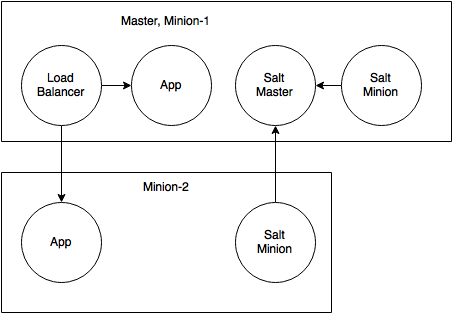

# Salt Multi host Demo

Clone this archive, start the VMs with `vagrant up`. The minions will register automatically with the master, but no provision will be executed. To do that, log in to the master with` vagrant ssh salt-demo-master` and provision the machines with `sudo salt '*' state.highstate`. Afterwards an apache should load balance the deployed Java app on both hosts. The source of the java app can be found in the `app` directory, to rebuild it execute `mvn package` and copy the JAR file to `salt/states/app.jar`.

Check out the [talk](https://der-tale.github.io/salt-introduction-talk) for more information about this demo and Salt.

